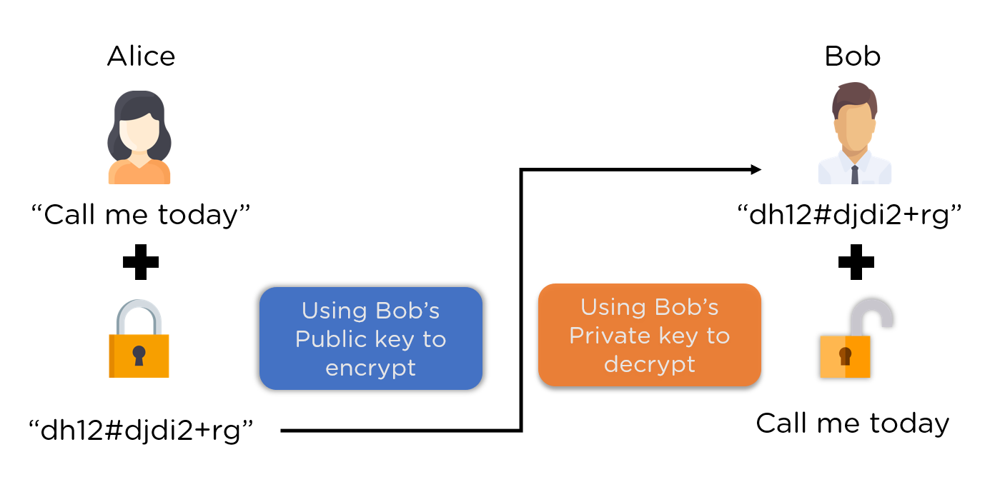

# 🔐 RSA Encryption and Decryption 🔓

This Python script demonstrates RSA encryption and decryption functionalities. It allows you to generate public and private key pairs, encrypt files using the public key, and decrypt encrypted files using the private key.

RSA (Rivest-Shamir-Adleman) is one of the first public-key cryptosystems and is widely used for secure data transmission. It is based on the mathematical properties of large prime numbers. In RSA, each participant has a pair of keys: a public key and a private key. The public key is used for encryption, while the private key is used for decryption. The security of RSA relies on the difficulty of factoring large composite numbers into their prime factors.




## Prerequisites

Ensure you have Python installed on your system.

## Usage

1. Run the script.
2. Input two prime numbers (`p` and `q`).
3. The script generates public and private key pairs.
4. Enter the path to the file you want to encrypt.
5. The encrypted file will be saved with a filename prefixed with "encrypted\_".
6. Optionally, you can choose to decrypt the file.
7. If decryption is chosen, provide the path to save the decrypted file.

## Functions

- `gcd(a, b)`: Computes the greatest common divisor of two numbers.
- `multiplicative_inverse(e, phi)`: Calculates the multiplicative inverse of `e` modulo `phi`.
- `is_prime(num)`: Checks if a number is prime.
- `generate_key_pair(p, q)`: Generates public and private key pairs.
- `encrypt(pk, file_path)`: Encrypts a file using the public key.
- `decrypt(pk, encrypted_data)`: Decrypts encrypted data using the private key.

## Example

```python
python rsa.py
```

---
<p align="center"><b>Thanks ❤️❤️❤️</b></p>
<p align="center">
  
</p>